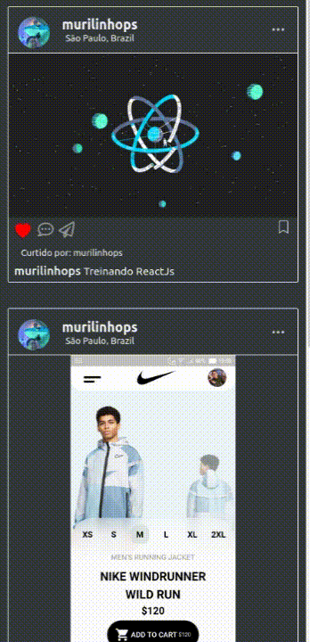
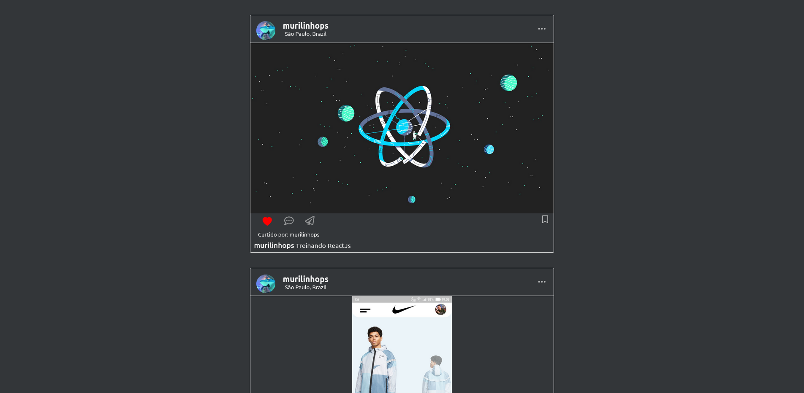
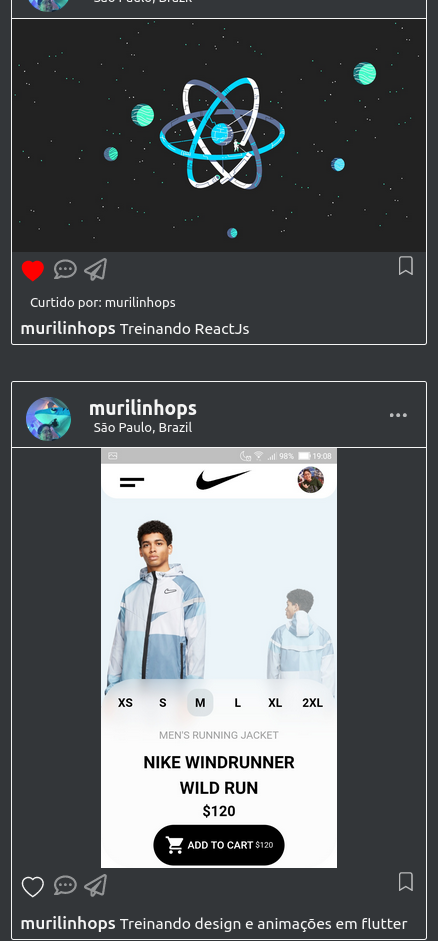

This project was bootstrapped with [Create React App](https://github.com/facebook/create-react-app).

# My_Reactgram

I'm cloning the instagram website interface to study some react concepts and to learn more about web development. I named this project myreactgram because is an instagram clone I'm building using react.

  

_________________________________________________________________________________________________________________________________________

    
 

    
     

_________________________________________________________________________________________________________________________________________

## Run application

1. Install node_modules - `yarn install`.
2. Run `yarn start` to open the app in the development mode.
3. Open [http://localhost:3000](http://localhost:3000) to view it in the browser.
The page will reload if you make edits. 
You will also see any lint errors in the console.

### Learn More

You can learn more in the [Create React App documentation](https://facebook.github.io/create-react-app/docs/getting-started).

To learn React, check out the [React documentation](https://reactjs.org/).